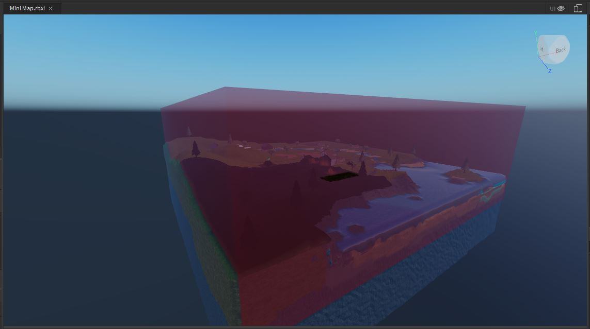
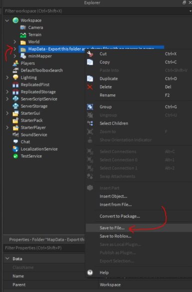
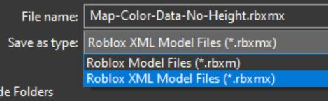
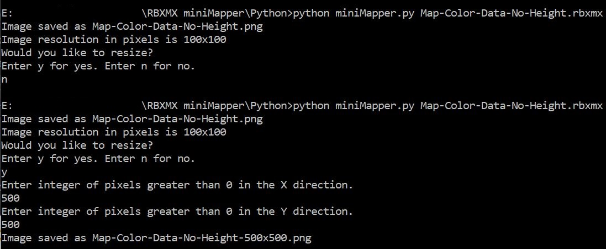
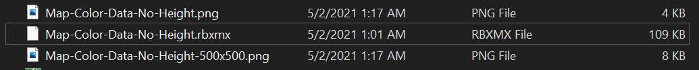
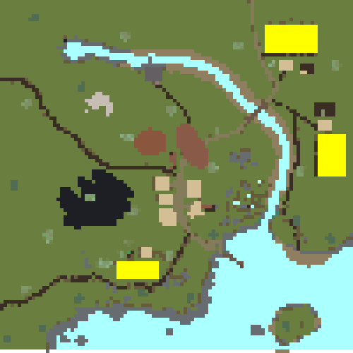

# RBXMX miniMapper

A project by Landon90

V.0.9.0

## Before you begin make sure...

-  **You save changes to your game.** If you try to make an image with too high of a resolution you can possibly crash your Roblox Studio. Know your computer's limits.

- If you want to run the Python script yourself make sure you have the latest verison of Python installed from [here](https://www.python.org/)

- If you are running the Python script yourself make sure you have [NumPy](https://numpy.org/install/) and [Pillow](https://pillow.readthedocs.io/en/stable/installation.html)

- If you don't want to use the Python script and are on Windows you can use the [miniMapper.exe](Python/miniMapper.exe) however some antivirus software my flag it. To run it anyways you will have to approve of the program in your antivirus. If you do not trust this .exe you can make it yourself, but it does require Python.

## Tutorial

### Step 1:

- Insert the [RBXMX miniMapper](https://www.roblox.com/library/6750600965/RBXMX-miniMapper) ModuleScript into your workspace.

If you would like to create this script yourself, check out the source code from [here](Roblox/miniMapper.lua)

- Type this into the command line. Feel free to leave the comment out, but do not yet press enter.

`local mapper = require(workspace.miniMapper:Clone()) --[[We clone this in the case you want to directly change the ModuleScript]]`

## Step 2:

- Size the Area part within the miniMapper ModuleScript to encompass the whole region you would like to have mapped.
    - Do not rotate the Area part. It must have an orientation of (0,0,0)

### Step 3:

- To set the resolution use the setResolution(x,y) function or change the script directly. If using the function your command line should look similar to the code below.

- If you are manipulating the code directly, change the miniMapper.resolutionX and miniMapper.resolutionY variables.

`local mapper = require(workspace.miniMapper:Clone())`

`mapper.setResolution(x,y) --[[Replace x,y with the resolution you would like the base data image to be. The higher the numbers the more work and higher chance of crashing.]]`

### Step 4:

- Choose the mode you would like to use to export.

- exportMap(applyHeightmap, heightRange)
    - exports the information needed to create a colored image of the map. If applyHeightmap is true then it adds shading based on the height information and heightRange. heightRange defaults to .6 if not specified, and is the range that V in HSV can be manipulated per pixel.

- exportHeightMap()
    - exports the information needed to create an image of only the heightmap in a grayscale format.

- exportAll(heightRange)
    - calls exportMap() exportMap(true, heightRange) and exportHeightMap() giving you all possible export folders.
    - be careful when using this on a high resolution.

`local mapper = require(workspace.miniMapper:Clone())`

`mapper.setResolution(x,y) --[[Replace x,y with the resolution you would like the base data image to be. The higher the numbers the more work and higher chance of crashing.]]`

`mapper.exportMap() --[[This will give us the map color with no height information. You can use any of the other export functions to substitute.]]`

### Step 5:

- Enter the chain of code into the command line.

- Wait for Studio to process the entire script and create the folder in workspace.

- Once the folder has been created, right click the folder and click 'Save to File...'

- Save the file as a .rbxmx with no spaces in the file name.

### Step 6:

- Pass the .rbxmx file into the Python script.
    - If you are using Python put the .rbxmx file in the same directory as miniMapper.py and try 
        - `python miniMapper.py RBXMX-File-Name.rbxmx`
    - If you are using [miniMapper.exe](Python/miniMapper.exe) you can just drag the .rbxmx file onto the miniMapper.exe file and it will run.
        - If you want to make the .exe file yourself run
            - `pyinstaller --onefile --icon=miniMapper.ico miniMapper.py`
    
- Files should end up in the same directory as the .rbxmx file.
    

Original

Upscaled

